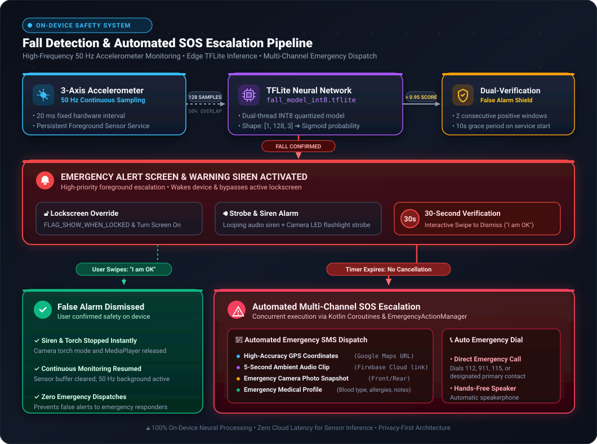
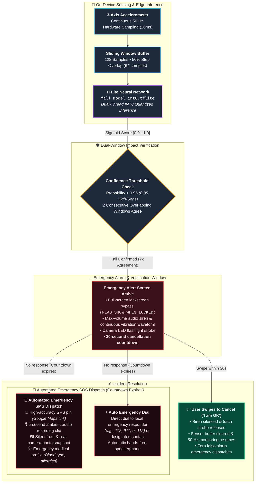

<div align="center">
  

  <h1>PocketPlanner</h1>
  <p><b>Your AI-Powered Travel Planning & Safety Companion for Android</b></p>
  <p>🏆 <i>Recognized as a Top 500 Project at Google Developer Group's AI Riser Vietnam 2026</i> 🏆</p>

<br/>

[](https://github.com/naofunyan/PocketPlanner)
[](https://kotlinlang.org/)
[](https://developer.android.com/jetpack/compose)
[](https://github.com/naofunyan/PocketPlanner/blob/main/LICENSE)
[](https://github.com/naofunyan/PocketPlanner/stargazers)

⭐️ If you find PocketPlanner useful, consider leaving a star to support the project ⭐️
</div>


</div>

## ℹ️ About

**PocketPlanner** is an open-source, offline-first travel planning and personal safety companion application for Android. Designed to streamline every stage of your journey, PocketPlanner pairs an intelligent itinerary manager and multi-currency expense tracker with next-generation Google Gemini AI capabilities - including real-time multimodal live voice/vision streaming and face-to-face interpretation.

Beyond seamless trip organization, PocketPlanner acts as a reliable guardian on the go: featuring an **on-device TensorFlow Lite machine learning model** that continuously monitors device accelerometer sensors at 50 Hz to detect falls and trigger automated emergency SOS dispatches with live GPS coordinates, ambient audio, and emergency calling.

Plan. Track. Explore. Spend less time organizing and more time experiencing, while traveling with complete peace of mind.

> [!IMPORTANT]
> * **Project Status:** This project was developed as a competition submission and is no longer actively maintained now that the competition has concluded. The codebase remains open for reference, demonstration, and educational purposes.
> * **Safety & Emergency Notice:** While the automated fall detection and SOS alert system is designed to provide rapid assistance in critical moments, it relies on mobile device sensors and telecommunication networks. It should complement, rather than replace, standard emergency procedures and services.

## 🛠️ Technologies

- `Kotlin 2.0`
- `Jetpack Compose & Material 3`
- `Google Gemini / Vertex AI`
- `Gemini Live Multimodal API`
- `TensorFlow Lite (INT8 Quantized)`
- `Google ML Kit (OCR & Translation)`
- `Mapbox Android SDK`
- `Google Play Services (Location & Geofencing)`
- `Room Database & DataStore`
- `Firebase (Auth, Firestore, Cloud Storage)`
- `Dagger Hilt`
- `Android WorkManager & Foreground Services`
- `CameraX`

## ✨ Features

Here's what you can do with PocketPlanner:

- **Smart Itinerary & Day Planning:** Organize your trips into detailed, day-by-day itineraries. Add points of interest with estimated costs, categories, scheduled visit times, user ratings, and personal notes.
- **Gemini AI Travel Assistant:** Consult a context-aware travel copilot for city guides, local dining tips, packing advice, and customized activity itineraries.
- **Gemini Live Multimodal Assistant:** Engage in real-time, hands-free conversational voice chats with visual understanding via live camera streaming over WebSockets.
- **Face-to-Face Interpreter & Live Translate:** Flip your phone around in dual-screen mode for fluid two-way conversations with locals, or scan street signs and menus instantly using camera OCR translation.
- **Smart Expense Tracker & Receipt Scanner:** Snap receipts to automatically parse merchants, dates, and amounts with OCR. Track trip budgets with visual category breakdowns and real-time multi-currency conversions.
- **Digital Ticket & Pass Wallet:** Stash boarding passes, bus vouchers, and event tickets in one secure place with integrated QR/barcode scanning and on-device QR code regeneration.
- **On-Device Fall Detection & SOS:** Protect yourself with an on-device 50 Hz accelerometer AI classifier. If a fall is detected, PocketPlanner initiates an emergency siren, flashlight strobe, full-screen lockscreen bypass, automated SMS dispatch with exact GPS coordinates (Google Maps link), ambient audio, emergency photo, and automated phone calls.
- **Explore & Immersive Audio Guides:** Discover top-rated attractions, browse stunning destination photography, and listen to immersive audio guides.
- **Offline-First Architecture:** Never get stranded without signal. All trips, tickets, itineraries, and logged expenses work seamlessly offline through local Room caching and sync automatically when internet connectivity resumes.

---

### 🤖 AI Hub Modes

The AI Hub brings together four specialized travel assistants accessible with a single swipe:

| Mode | Technology | Description |
| :--- | :--- | :--- |
| **💬 Chat** | Google Gemini / Vertex AI | Text-based travel advisor that provides recommendations, creates itineraries, and answers destination queries. |
| **🎙️ Live** | Gemini Live & OkHttp WebSockets | Real-time, ultra-low-latency voice interaction with camera video streaming for live environmental awareness. |
| **📷 Translate** | ML Kit OCR & Translate | Point your camera at menus, warning signs, or transit schedules for instant on-screen text translation. |
| **🗣️ Interpreter** | ML Kit Language ID & Audio TTS | Bidirectional dual-sided screen interface for natural conversations between two speakers in different languages. |

---

### 🛡️ Safety & Fall Detection System

PocketPlanner prioritizes traveler safety, especially for solo explorers and outdoor adventurers:

<p align="center">
  
</p>

<details>
<summary><b>📐 View Interactive Flowchart (Mermaid)</b></summary>



</details>

- **Zero-Cloud Sensor Processing:** Raw sensor data is evaluated locally on the device at 50 Hz by `fall_model_int8.tflite` to ensure rapid detection without latency or privacy concerns.
- **Lockscreen Override:** Launches full-screen alerts even when your device is locked, giving you a quick swipe gesture to cancel false alarms or instantly call for help.
- **Offline Medical Card:** Provides first responders with instant access to blood type, critical allergies, medications, emergency contacts, and organ donor status.

---

### 🗂️ Digital Wallet & Supported Passes

Store and access your essential travel documents without internet access:

| Pass Type | Supported Formats | Features |
| :--- | :--- | :--- |
| ✈️ Flight Boarding Passes | QR Code, PDF | Flight number, gate, departure time, seat number |
| 🚆 Train & Bus Tickets | QR Code, Data Matrix, Barcode | Booking reference, platform, validity dates |
| 🏨 Hotel & Stay Bookings | Text, Confirmation Code, Images | Check-in/out times, address, confirmation details |
| 🎟️ Museum & Event Tickets | QR Code, Barcode, Images | On-device QR regeneration for easy terminal scanning |
| 🧾 Receipts & Invoices | Image Crop & ML Kit Text OCR | Automatic parsing of total, merchant, date, and currency |

---

### 🌐 Language Support

PocketPlanner features full internationalization with dynamic runtime language switching:

- 🇬🇧 **English** (Default)
- 🇻🇳 **Vietnamese** (Tiếng Việt)

---

## 🎯 How Can It Be Improved?
- [ ] Add AI-powered automated itinerary generation from imported confirmation emails
- [ ] Develop Wear OS companion app for smartwatch fall alerts and quick itinerary glance
- [ ] Enable collaborative multi-user itinerary sharing and live sync
- [ ] Publish PocketPlanner to the Google Play Store

---

## 💾 Getting Started

### Prerequisites

- **Android Studio:** Latest stable version
- **JDK:** Java 17
- **Android SDK:** Minimum SDK 26 (Android 8.0 Oreo), Target SDK 34 (Android 14)
- **Device / Emulator:** Google Play Services enabled device with camera and sensors for full feature testing

### Installation & Setup

1. **Clone the repository:**
   ```bash
   git clone https://github.com/naofunyan/PocketPlanner.git
   cd PocketPlanner
   ```

2. **Configure API Keys:**
   Create a `local.properties` file in the root directory (or set environment variables):
   ```properties
   VERTEX_API_KEY="your_vertex_ai_or_gemini_api_key"
   MAPBOX_ACCESS_TOKEN="your_mapbox_access_token"
   FOURSQUARE_API_KEY="your_foursquare_api_key"
   GOOGLE_PLACES_API_KEY="your_google_places_api_key"
   UNSPLASH_API_KEY="your_unsplash_access_key"
   ```

3. **Configure Firebase:**
   - Create a project on the [Firebase Console](https://console.firebase.google.com/).
   - Add an Android app with package name `com.example.pocketplanner`.
   - Download `google-services.json` and place it in the `app/` directory (`app/google-services.json`).
   - Enable **Firebase Authentication** (Google & Email/Password), **Cloud Firestore**, and **Cloud Storage**.
   - *(Optional)* Deploy Firebase Cloud Functions located in the `functions/` directory for secure server-side Vertex token exchange:
     ```bash
     cd functions
     npm install
     firebase deploy --only functions
     ```

4. **Build and Run:**
   Open the project in Android Studio and run the `app` configuration on your connected device, or build via command line:
   ```bash
   # Build debug APK
   ./gradlew assembleDebug

   # Install directly onto connected ADB device
   ./gradlew installDebug
   ```

---

## ⚖️ License

The source code is licensed under the [GNU General Public License v3.0](LICENSE). The name "PocketPlanner", its logo, and related brand assets are the exclusive property of Naofunyan and **are not** covered by the GPLv3 license.

#### Liability:
This application is provided "AS IS" and used at your own risk. The developers and contributors are not liable for any claims, damages, or other liability — including any legal or medical consequences — arising from or in connection with the software or its use. While the fall detection and emergency SOS features are engineered to assist in emergencies, PocketPlanner is not a certified medical device and does not guarantee dispatch delivery under all conditions (such as loss of cellular network, disabled device permissions, or hardware failure). All responsibility for travel safety and outcomes rests entirely with the user.
