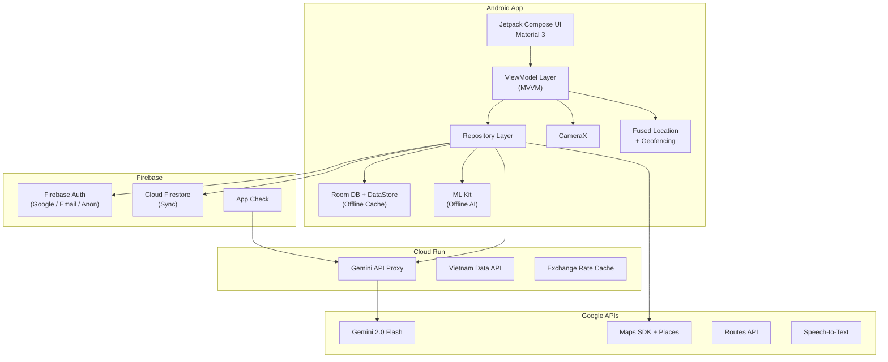

# PocketPlanner (PocketNomad) — AI-Powered Vietnam Travel Companion

An Android Kotlin app for Google AI Studio Hackathon Challenge #14: *"Xây dựng hành trình du lịch cá nhân hoá"* — personalized travel itinerary builder with real-time AI interaction, vision AI, expense tracking, and offline capabilities. Focused on Vietnam.

---

## ✅ Confirmed Decisions

| Decision | Answer |
|----------|--------|
| **API Budget** | Google Cloud credits available |
| **Backend** | Full backend — Cloud Run (Gemini proxy + data API) + Firebase (Auth + Firestore) |
| **Auth** | Google Sign-In + Email/Password + Anonymous guest mode (linkable) |
| **Cross-device sync** | Yes — via Cloud Firestore |
| **Vietnam data** | Pre-seeded curated data for 8–10 major cities |
| **Languages** | Vietnamese, English, Japanese, Korean, Chinese (Simplified) |

---

## Architecture Overview



---

## Proposed Changes

### Sprint 1 (Days 1–7): Foundation + Core Features

---

#### 1A. Project Setup & Build System

##### [NEW] `build.gradle.kts` (Project-level)
- Android Gradle Plugin, Kotlin 2.0.21, Compose compiler
- Plugins: Hilt (2.60.1), KSP (2.0.21-1.0.25), Google Services, Kotlin Serialization

##### [NEW] `app/build.gradle.kts`
Full dependency list:

```kotlin
// === Core Android ===
androidx.core:core-ktx
androidx.lifecycle:lifecycle-runtime-compose:2.8.4
androidx.activity:activity-compose

// === Compose + Material 3 ===
androidx.compose:compose-bom:2026.06.01
androidx.compose.material3:material3
androidx.compose.ui:ui, ui-graphics, ui-tooling-preview
androidx.compose.material:material-icons-extended

// === Navigation (Type-Safe) ===
androidx.navigation:navigation-compose:2.9.8
org.jetbrains.kotlinx:kotlinx-serialization-json:1.7.3

// === Dependency Injection ===
com.google.dagger:hilt-android:2.60.1
androidx.hilt:hilt-navigation-compose:1.2.0
androidx.hilt:hilt-work:1.2.0

// === Database (Offline) ===
androidx.room:room-runtime:2.8.4
androidx.room:room-ktx:2.8.4

// === Preferences ===
androidx.datastore:datastore-preferences:1.2.1

// === Firebase ===
com.google.firebase:firebase-bom:33.7.0
com.google.firebase:firebase-auth-ktx
com.google.firebase:firebase-firestore-ktx
com.google.firebase:firebase-appcheck-playintegrity

// === Google AI (Gemini) ===
com.google.ai.client.generativeai:generativeai:0.9.0

// === Google Maps ===
com.google.android.gms:play-services-maps:19.0.0
com.google.maps.android:maps-compose:6.3.0
com.google.android.libraries.places:places:4.2.0

// === Location & Geofencing ===
com.google.android.gms:play-services-location:21.4.0

// === ML Kit (Offline AI) ===
com.google.mlkit:translate:17.0.3
com.google.mlkit:image-labeling:17.0.9
com.google.android.gms:play-services-mlkit-text-recognition:19.0.1
com.google.mlkit:language-id:17.0.6

// === CameraX ===
androidx.camera:camera-core:1.6.1
androidx.camera:camera-camera2:1.6.1
androidx.camera:camera-lifecycle:1.6.1
androidx.camera:camera-view:1.6.1

// === Networking ===
com.squareup.retrofit2:retrofit
com.squareup.okhttp3:okhttp
org.jetbrains.kotlinx:kotlinx-coroutines-play-services:1.8.1

// === Background Work ===
androidx.work:work-runtime-ktx:2.11.2

// === Image Loading ===
io.coil-kt:coil-compose:2.7.0

// === Google Sign-In ===
com.google.android.gms:play-services-auth
```

##### [NEW] `gradle/libs.versions.toml`
- Version catalog for all dependencies

##### [NEW] `settings.gradle.kts`
- Module declaration, plugin management

##### [NEW] `local.properties` (gitignored)
- `GEMINI_API_KEY`, `MAPS_API_KEY`

##### [NEW] `app/src/main/AndroidManifest.xml`
- Permissions: INTERNET, ACCESS_FINE_LOCATION, ACCESS_BACKGROUND_LOCATION, CAMERA, POST_NOTIFICATIONS, RECORD_AUDIO
- Google Maps metadata, Firebase initialization
- Geofence BroadcastReceiver, Location ForegroundService

---

#### 1B. Design System & Theme

##### [NEW] `app/src/main/java/com/pocketnomad/ui/theme/Color.kt`
Vietnam-inspired color palette:
- **Primary**: Deep Jade `#00695C` (lush landscapes)
- **Secondary**: Lantern Gold `#FFB300` (Hoi An lanterns)
- **Tertiary**: Ocean Blue `#0277BD` (Ha Long Bay)
- **Accent**: Vermillion Red `#D32F2F` (flag, culture)
- **Surface/Background**: Dark charcoal tones for dark mode
- **Neutral**: Warm grays

##### [NEW] `app/src/main/java/com/pocketnomad/ui/theme/Type.kt`
- Google Fonts: **Inter** for body, **Outfit** for headings
- Responsive typography scale

##### [NEW] `app/src/main/java/com/pocketnomad/ui/theme/Theme.kt`
- Material 3 light + dark color schemes
- Dynamic color support (Android 12+)
- Custom shape scheme (rounded corners)

##### [NEW] `app/src/main/java/com/pocketnomad/ui/components/`
Reusable UI components:
- `PocketCard.kt` — Glassmorphism-style card with subtle blur
- `GradientButton.kt` — Gradient-filled CTA buttons
- `ShimmerLoading.kt` — Shimmer effect for loading states
- `AnimatedBottomBar.kt` — Animated bottom navigation bar
- `PlaceChip.kt` — Category filter chips (Food, Culture, Nature, etc.)

---

#### 1C. Core Data Layer

##### [NEW] `app/src/main/java/com/pocketnomad/data/local/AppDatabase.kt`
Room database with entities:
```kotlin
@Database(
    entities = [
        TripEntity::class,
        DayPlanEntity::class,
        PlaceEntity::class,
        ExpenseEntity::class,
        CityInfoEntity::class,
        TrackingPointEntity::class,
        UserProfileEntity::class
    ],
    version = 1
)
abstract class AppDatabase : RoomDatabase()
```

##### [NEW] `app/src/main/java/com/pocketnomad/data/local/entity/`
| Entity | Key Fields |
|--------|------------|
| `TripEntity` | id, userId, destination, startDate, endDate, budget, currency, status, synced |
| `DayPlanEntity` | id, tripId, dayNumber, date, placesJson (ordered), notes, synced |
| `PlaceEntity` | id, name, lat, lng, category, estimatedDuration, estimatedCost, description, imageUrl, rating, cityName |
| `ExpenseEntity` | id, tripId, userId, category, amount, currency, convertedAmountVND, description, date, photoUri, synced |
| `CityInfoEntity` | id, cityName, province, description, highlights, bestTimeToVisit, currency, language, imageUrl, cachedAt |
| `TrackingPointEntity` | id, tripId, lat, lng, timestamp, accuracy |
| `UserProfileEntity` | id, firebaseUid, displayName, email, photoUrl, preferredLanguage, preferredCurrency |

##### [NEW] `app/src/main/java/com/pocketnomad/data/local/dao/`
- `TripDao.kt` — CRUD + query by userId, status
- `DayPlanDao.kt` — CRUD + query by tripId, dayNumber
- `PlaceDao.kt` — CRUD + query by cityName, category
- `ExpenseDao.kt` — CRUD + sum by tripId, category; budget remaining
- `CityInfoDao.kt` — CRUD + query by cityName
- `TrackingPointDao.kt` — Insert points, query by tripId + time range
- `UserProfileDao.kt` — CRUD for cached user profile

---

#### 1D. Firebase Auth Integration

##### [NEW] `app/src/main/java/com/pocketnomad/data/auth/AuthRepository.kt`
```kotlin
interface AuthRepository {
    val currentUser: Flow<User?>
    val isLoggedIn: Boolean
    suspend fun signInWithGoogle(idToken: String): Result<User>
    suspend fun signInWithEmail(email: String, password: String): Result<User>
    suspend fun signUpWithEmail(email: String, password: String): Result<User>
    suspend fun signInAnonymously(): Result<User>
    suspend fun linkAnonymousAccount(credential: AuthCredential): Result<User>
    suspend fun signOut()
}
```

##### [NEW] `app/src/main/java/com/pocketnomad/data/auth/AuthRepositoryImpl.kt`
- Firebase Auth implementation
- Handles Google Sign-In credential exchange
- Anonymous → linked account upgrade flow
- Emits user state changes via `callbackFlow`

##### [NEW] `app/src/main/java/com/pocketnomad/feature/auth/`
| File | Purpose |
|------|---------|
| `AuthViewModel.kt` | Login/signup state management |
| `LoginScreen.kt` | Beautiful login screen with Google button, email form, guest option |
| `SignUpScreen.kt` | Registration form |
| `ProfileScreen.kt` | User profile + settings + sign out |

---

#### 1E. Cloud Firestore Sync Layer

##### [NEW] `app/src/main/java/com/pocketnomad/data/sync/FirestoreSyncManager.kt`
Handles bidirectional sync between Room (local) and Firestore (cloud):
```kotlin
class FirestoreSyncManager @Inject constructor(
    private val firestore: FirebaseFirestore,
    private val tripDao: TripDao,
    private val expenseDao: ExpenseDao,
    private val authRepository: AuthRepository
) {
    // Upload unsynced local changes to Firestore
    suspend fun pushLocalChanges()
    
    // Pull remote changes from Firestore to Room
    suspend fun pullRemoteChanges()
    
    // Real-time listener for live sync
    fun observeRemoteChanges(): Flow<SyncEvent>
}
```

Firestore collections structure:
```
users/{userId}/
    profile: { displayName, email, preferredLanguage, preferredCurrency }
    trips/{tripId}: { destination, startDate, endDate, budget, ... }
        dayPlans/{dayPlanId}: { dayNumber, places, notes }
        expenses/{expenseId}: { category, amount, currency, ... }
```

##### [NEW] `app/src/main/java/com/pocketnomad/data/sync/SyncWorker.kt`
- WorkManager periodic sync (every 15 min when online)
- Conflict resolution: last-write-wins with timestamp comparison

---

#### 1F. Navigation & App Shell

##### [NEW] `app/src/main/java/com/pocketnomad/navigation/`

| File | Purpose |
|------|---------|
| `Routes.kt` | Type-safe navigation routes using `@Serializable` |
| `AppNavGraph.kt` | Top-level NavHost with auth gate |
| `BottomNavBar.kt` | Animated bottom navigation (Home, Explore, Chat, Expense, Profile) |

Routes definition:
```kotlin
@Serializable object HomeRoute
@Serializable object ExploreRoute
@Serializable object ChatRoute
@Serializable object ExpenseRoute
@Serializable object ProfileRoute
@Serializable data class ItineraryRoute(val tripId: String)
@Serializable data class DayPlanRoute(val tripId: String, val dayNumber: Int)
@Serializable data class CityDetailRoute(val cityName: String)
@Serializable object VisionRoute
@Serializable object TrackingRoute
@Serializable object CreateTripRoute
@Serializable object LoginRoute
@Serializable object CurrencyConverterRoute
```

##### [NEW] `app/src/main/java/com/pocketnomad/MainActivity.kt`
- Single Activity, Compose host, Hilt entry point
- Check auth state → route to Login or Home

##### [NEW] `app/src/main/java/com/pocketnomad/PocketNomadApp.kt`
- `@HiltAndroidApp` Application class
- Initialize Firebase, Places SDK

---

#### 1G. Itinerary Feature (Core)

##### [NEW] `app/src/main/java/com/pocketnomad/feature/itinerary/`

| File | Purpose |
|------|---------|
| `ItineraryViewModel.kt` | Generate itinerary via Gemini, manage day plans, sync |
| `ItineraryScreen.kt` | Trip overview — list of day cards with summary |
| `DayPlanScreen.kt` | Single day — ordered places, map, time estimates, transport |
| `CreateTripScreen.kt` | Multi-step form: destination, dates, budget, interests, style |
| `RouteMapScreen.kt` | Google Map with polyline route, markers, turn-by-turn |

**Gemini Itinerary Generation Flow**:
1. User fills in: city, dates, budget (VND), interests (food/culture/nature/adventure/nightlife), travel style (budget/comfort/luxury)
2. App sends structured prompt to Gemini via Cloud Run proxy
3. Gemini returns JSON with optimized daily plans
4. App calls Google Routes API to calculate real travel times between places
5. Plans are saved to Room + synced to Firestore

**Gemini Prompt Template**:
```
You are an expert Vietnam travel planner. Create a detailed {days}-day 
itinerary for {city}, Vietnam.

Traveler profile:
- Budget: {budget} VND ({budgetUSD} USD)  
- Interests: {interests}
- Travel style: {style}
- Group size: {groupSize}

Requirements:
- Optimize route to minimize travel time between locations
- Include specific restaurant recommendations for each meal
- Estimate costs in VND for each activity and meal
- Total daily costs must stay within daily budget allocation
- Include travel time and transport method between locations
- Consider opening hours and best times to visit

Return ONLY valid JSON in this exact format:
{
  "tripSummary": "...",
  "totalEstimatedCost": 0,
  "days": [{
    "dayNumber": 1,
    "theme": "...",
    "places": [{
      "name": "...",
      "lat": 0.0, "lng": 0.0,
      "category": "attraction|restaurant|cafe|market|temple|museum|beach|park",
      "estimatedDuration": "1h30m",
      "estimatedCost": 50000,
      "description": "...",
      "bestTimeToVisit": "08:00",
      "tips": "..."
    }],
    "transportSuggestions": ["..."],
    "dailyBudget": 0
  }]
}
```

---

#### 1H. Expense Tracker Feature

##### [NEW] `app/src/main/java/com/pocketnomad/feature/expense/`

| File | Purpose |
|------|---------|
| `ExpenseViewModel.kt` | CRUD expenses, currency conversion, budget tracking, sync |
| `ExpenseListScreen.kt` | Expenses grouped by day/category, pie chart, totals |
| `AddExpenseScreen.kt` | Quick add: category picker (icons), amount, currency, note |
| `CurrencyConverterScreen.kt` | Standalone converter with 6+ currencies |
| `BudgetOverviewScreen.kt` | Visual budget remaining vs. spent (progress bar + chart) |

**Currency Support**: VND, USD, EUR, JPY, KRW, CNY, THB, GBP, AUD
- Exchange rates fetched from API and cached in DataStore
- Offline conversion using last-cached rates
- All expenses stored in original currency + converted to VND for budget tracking

**Expense Categories** (with icons):
🍜 Food & Drink, 🚕 Transport, 🏨 Accommodation, 🎫 Activities, 🛍️ Shopping, 💊 Health, 📱 Communication, 💰 Other

---

### Sprint 2 (Days 8–14): AI Features + Explore

---

#### 2A. Real-time AI Chat (QA + Multi-language)

##### [NEW] `app/src/main/java/com/pocketnomad/feature/chat/`

| File | Purpose |
|------|---------|
| `ChatViewModel.kt` | Gemini chat with streaming, context injection |
| `ChatScreen.kt` | Chat UI — message bubbles, voice button, language selector, typing indicator |
| `VoiceInputManager.kt` | Android SpeechRecognizer for voice → text |
| `TranslationManager.kt` | ML Kit on-device translation |
| `ChatMessage.kt` | Data class for chat messages (text, sender, timestamp, language) |

**Implementation Details**:
- **Gemini Multi-turn Chat**: `startChat()` with injected context (current trip, location, itinerary)
- **Streaming responses**: `sendMessageStream()` → animate text appearing word by word
- **Voice input**: Android `SpeechRecognizer` (supports Vietnamese, English, Japanese, Korean, Chinese)
- **Real-time translation**: User types in any supported language → ML Kit detects language → translates response
- **Context-aware**: System prompt includes user's current trip details, nearby places, budget status

**System Prompt for Chat**:
```
You are PocketNomad, a friendly and knowledgeable AI travel assistant 
specializing in Vietnam. You help travelers with:
- Local recommendations (food, activities, hidden gems)
- Cultural tips and etiquette
- Navigation and transport advice
- Price negotiations and scam awareness
- Emergency information
- Translation help

Current context:
- User is in: {currentCity}
- Current trip: {tripSummary}
- Today's plan: {todaysPlan}
- Budget remaining: {budgetRemaining} VND
- Language preference: {preferredLanguage}

Always be enthusiastic, culturally sensitive, and provide practical advice.
Include prices in VND when relevant.
```

---

#### 2B. AI Vision (Google Lens-like)

##### [NEW] `app/src/main/java/com/pocketnomad/feature/vision/`

| File | Purpose |
|------|---------|
| `VisionViewModel.kt` | Send captured image to Gemini multimodal, display results |
| `VisionScreen.kt` | Camera preview + capture button + results bottom sheet |
| `CameraManager.kt` | CameraX lifecycle management, image capture |
| `VisionResultCard.kt` | Beautiful result display with image, info, and actions |

**Implementation Flow**:
1. User opens camera (CameraX preview)
2. Taps capture → takes photo as Bitmap
3. Bitmap sent to Gemini multimodal with vision prompt:
```
Analyze this image taken by a tourist in Vietnam. Identify what's shown 
and provide:
1. What it is (landmark, food, sign, object, plant, animal)
2. Name (in Vietnamese and English)
3. Historical/cultural significance (if applicable)
4. Practical info (price range, opening hours, how to get there)
5. Fun facts or tips
6. If it's text/menu: translate to {userLanguage}

Be concise but informative. Format your response clearly.
```
4. **Offline fallback**: ML Kit Image Labeling (basic labels) + Text Recognition (OCR + translate)
5. Results shown in an animated bottom sheet with save-to-trip option

---

#### 2C. Explore Feature (City Info)

##### [NEW] `app/src/main/java/com/pocketnomad/feature/explore/`

| File | Purpose |
|------|---------|
| `ExploreViewModel.kt` | Load cities, fetch detailed info via Gemini, cache in Room |
| `ExploreScreen.kt` | Scrollable grid of Vietnam city cards with beautiful photos |
| `CityDetailScreen.kt` | Full city guide: overview, attractions, food, culture, tips |
| `CategorySection.kt` | Reusable section for attractions, restaurants, etc. |

**Pre-seeded Vietnam Cities** (with curated data in Room):

| City | Province | Highlight |
|------|----------|-----------|
| 🏛️ Hanoi | Hà Nội | Capital, Old Quarter, street food paradise |
| 🌆 Ho Chi Minh City | TP. HCM | Dynamic metropolis, Cu Chi Tunnels |
| 🏮 Hoi An | Quảng Nam | Ancient town, lanterns, tailoring |
| 🏯 Hue | Thừa Thiên Huế | Imperial citadel, royal cuisine |
| 🏖️ Da Nang | Đà Nẵng | Beaches, Ba Na Hills, Dragon Bridge |
| 🏝️ Nha Trang | Khánh Hòa | Beach resort, island hopping |
| 🌸 Da Lat | Lâm Đồng | Highland town, flowers, cool climate |
| 🏝️ Phu Quoc | Kiên Giang | Island paradise, snorkeling |
| 🌾 Sapa | Lào Cai | Rice terraces, trekking, ethnic villages |
| 🛥️ Ha Long Bay | Quảng Ninh | UNESCO World Heritage, limestone karsts |

Each city entry includes:
- Overview description (3-4 paragraphs)
- Top 10 attractions with lat/lng
- Must-try local dishes (5–8 per city)
- Getting there (transport from major cities)
- Best time to visit
- Average daily budget (budget/mid/luxury)
- Cultural tips specific to the region
- Emergency contacts

**On-demand enrichment**: Tapping "Learn More" fetches detailed AI-generated content via Gemini, cached in Room for offline.

---

#### 2D. Hilt Dependency Injection Setup

##### [NEW] `app/src/main/java/com/pocketnomad/di/`

| File | Purpose |
|------|---------|
| `AppModule.kt` | Application-scoped singletons (context, DataStore) |
| `DatabaseModule.kt` | Room database + all DAOs |
| `NetworkModule.kt` | Retrofit, OkHttp, API services |
| `FirebaseModule.kt` | FirebaseAuth, Firestore, AppCheck instances |
| `AIModule.kt` | Gemini GenerativeModel, ML Kit translators |
| `LocationModule.kt` | FusedLocationProviderClient, GeofencingClient |

---

### Sprint 3 (Days 15–21): Location Features + Polish

---

#### 3A. Trip Tracking

##### [NEW] `app/src/main/java/com/pocketnomad/feature/tracking/`

| File | Purpose |
|------|---------|
| `TrackingViewModel.kt` | Start/stop tracking, observe location updates |
| `TrackingScreen.kt` | Live map with user path polyline, visited markers |
| `LocationTrackingService.kt` | Foreground service for continuous GPS tracking |
| `TrackingRepository.kt` | Store GPS points in Room, query tracks |

**Implementation**:
- Fused Location Provider with `LocationRequest.Builder()` — balanced accuracy, ~10s intervals
- Foreground service with persistent notification ("Tracking your trip...")
- Draw polyline on Google Map from tracked points
- Auto-detect visited places: when user is within 50m of an itinerary place for >5 min, mark as "visited" ✅
- Post-trip summary: total distance, time spent, places visited

---

#### 3B. Proximity Notifications (Geofencing)

##### [NEW] `app/src/main/java/com/pocketnomad/feature/notification/`

| File | Purpose |
|------|---------|
| `GeofenceManager.kt` | Register/unregister geofences for interesting places |
| `GeofenceBroadcastReceiver.kt` | Handle ENTER transitions |
| `NotificationHelper.kt` | Rich notifications with place photo + quick info |
| `DynamicGeofenceWorker.kt` | WorkManager — refresh geofences as user moves |

**Strategy**:
- On trip start: register geofences for today's itinerary places + top nearby attractions
- Radius: 200m for major attractions, 100m for restaurants/cafes
- On `GEOFENCE_TRANSITION_ENTER`:
  - Show notification: "📍 You're near **Temple of Literature**! Tap for details"
  - Notification opens place detail with description, tips, cost
- Dynamic refresh: every 30 min, update geofences based on current location (max 100 active)
- Battery-efficient: uses hardware geofence monitoring, not continuous GPS

---

#### 3C. Offline Support Layer

##### [NEW] `app/src/main/java/com/pocketnomad/core/offline/`

| File | Purpose |
|------|---------|
| `OfflineManager.kt` | Coordinate offline data availability |
| `NetworkMonitor.kt` | ConnectivityManager observer → Flow<Boolean> |
| `SyncScheduler.kt` | Schedule sync via WorkManager when back online |

**Offline Capabilities Matrix**:

| Feature | Offline | How |
|---------|---------|-----|
| View itinerary | ✅ Full | Cached in Room |
| View day plans | ✅ Full | Cached in Room |
| Add/edit expenses | ✅ Full | Room (syncs when online) |
| Currency conversion | ✅ Cached | Last-fetched rates in DataStore |
| AI Chat | ❌ | Requires Gemini API |
| AI Vision (full) | ❌ | Requires Gemini API |
| AI Vision (basic) | ⚠️ Partial | ML Kit labels + OCR |
| Translation | ✅ Full | ML Kit downloaded models |
| City explore | ✅ Full | Pre-seeded + cached in Room |
| Trip tracking | ✅ Full | GPS + Room (syncs later) |
| Maps | ⚠️ Cached | Previously viewed tiles |
| Notifications | ✅ Full | Geofences work offline |

**Offline indicator**: Subtle banner at top when offline — "You're offline. Changes will sync when connected."

---

#### 3D. Cloud Run Backend

##### [NEW] `backend/` directory

| File | Purpose |
|------|---------|
| `main.py` | FastAPI server |
| `routers/gemini.py` | `/api/v1/generate-itinerary`, `/api/v1/chat`, `/api/v1/vision` |
| `routers/data.py` | `/api/v1/cities`, `/api/v1/city/{name}`, `/api/v1/exchange-rates` |
| `services/gemini_service.py` | Gemini API wrapper with rate limiting |
| `services/data_service.py` | Vietnam city data + exchange rates |
| `models/schemas.py` | Pydantic request/response models |
| `Dockerfile` | Python 3.12 slim container |
| `requirements.txt` | fastapi, uvicorn, google-genai, httpx |
| `cloudbuild.yaml` | Cloud Build → Cloud Run deployment |

**Endpoints**:
```
POST /api/v1/generate-itinerary    → Gemini itinerary generation
POST /api/v1/chat                  → Gemini chat (streaming SSE)
POST /api/v1/vision                → Gemini multimodal vision
GET  /api/v1/cities                → List all pre-seeded cities
GET  /api/v1/city/{name}           → Detailed city info
GET  /api/v1/exchange-rates        → Current exchange rates (cached 1h)
GET  /api/v1/health                → Health check
```

**Security**: Firebase App Check token validation on all endpoints

---

#### 3E. Home Screen & Polish

##### [NEW] `app/src/main/java/com/pocketnomad/feature/home/`

| File | Purpose |
|------|---------|
| `HomeViewModel.kt` | Aggregate active trip, upcoming plans, quick actions |
| `HomeScreen.kt` | Dashboard with greeting, active trip card, quick actions grid |

**Home Screen Layout**:
```
┌─────────────────────────────┐
│ 🌅 Good morning, {name}!    │
│ You're in {city}, Vietnam   │
├─────────────────────────────┤
│ ┌─────────────────────────┐ │
│ │  Active Trip Card       │ │
│ │  "3-Day Hanoi Adventure"│ │
│ │  Day 2/3 • 3.2M/5M VND │ │
│ │  [View Plan] [Track]    │ │
│ └─────────────────────────┘ │
├─────────────────────────────┤
│  Today's Plan (horizontal)  │
│  ┌────┐ ┌────┐ ┌────┐      │
│  │9AM │ │12PM│ │3PM │ ...  │
│  │Temp│ │Pho │ │Walk│      │
│  └────┘ └────┘ └────┘      │
├─────────────────────────────┤
│  Quick Actions (grid)       │
│  [📸 Vision] [💬 Chat]     │
│  [📊 Budget] [🗺️ Explore]  │
├─────────────────────────────┤
│  Nearby Recommendations     │
│  ... (from Places API)      │
└─────────────────────────────┘
```

---

## Complete Project Structure

```
PocketPlanner/
├── app/
│   ├── build.gradle.kts
│   └── src/main/
│       ├── AndroidManifest.xml
│       ├── res/
│       │   ├── values/          (strings, colors, themes)
│       │   ├── drawable/        (icons, splash)
│       │   └── font/            (Inter, Outfit)
│       └── java/com/pocketnomad/
│           ├── PocketNomadApp.kt
│           ├── MainActivity.kt
│           ├── di/
│           │   ├── AppModule.kt
│           │   ├── DatabaseModule.kt
│           │   ├── NetworkModule.kt
│           │   ├── FirebaseModule.kt
│           │   ├── AIModule.kt
│           │   └── LocationModule.kt
│           ├── core/
│           │   ├── offline/
│           │   │   ├── OfflineManager.kt
│           │   │   ├── NetworkMonitor.kt
│           │   │   └── SyncScheduler.kt
│           │   ├── location/
│           │   │   └── LocationHelper.kt
│           │   └── util/
│           │       ├── DateUtils.kt
│           │       ├── CurrencyUtils.kt
│           │       └── Extensions.kt
│           ├── data/
│           │   ├── local/
│           │   │   ├── AppDatabase.kt
│           │   │   ├── Converters.kt
│           │   │   ├── entity/ (7 entities)
│           │   │   └── dao/ (7 DAOs)
│           │   ├── remote/
│           │   │   ├── PocketNomadApi.kt
│           │   │   ├── GeminiService.kt
│           │   │   └── ExchangeRateApi.kt
│           │   ├── repository/
│           │   │   ├── TripRepository.kt
│           │   │   ├── ExpenseRepository.kt
│           │   │   ├── ExploreRepository.kt
│           │   │   ├── ChatRepository.kt
│           │   │   └── TrackingRepository.kt
│           │   ├── auth/
│           │   │   ├── AuthRepository.kt
│           │   │   └── AuthRepositoryImpl.kt
│           │   └── sync/
│           │       ├── FirestoreSyncManager.kt
│           │       └── SyncWorker.kt
│           ├── feature/
│           │   ├── home/
│           │   │   ├── HomeViewModel.kt
│           │   │   └── HomeScreen.kt
│           │   ├── auth/
│           │   │   ├── AuthViewModel.kt
│           │   │   ├── LoginScreen.kt
│           │   │   ├── SignUpScreen.kt
│           │   │   └── ProfileScreen.kt
│           │   ├── itinerary/
│           │   │   ├── ItineraryViewModel.kt
│           │   │   ├── ItineraryScreen.kt
│           │   │   ├── DayPlanScreen.kt
│           │   │   ├── CreateTripScreen.kt
│           │   │   └── RouteMapScreen.kt
│           │   ├── chat/
│           │   │   ├── ChatViewModel.kt
│           │   │   ├── ChatScreen.kt
│           │   │   ├── VoiceInputManager.kt
│           │   │   ├── TranslationManager.kt
│           │   │   └── ChatMessage.kt
│           │   ├── vision/
│           │   │   ├── VisionViewModel.kt
│           │   │   ├── VisionScreen.kt
│           │   │   ├── CameraManager.kt
│           │   │   └── VisionResultCard.kt
│           │   ├── expense/
│           │   │   ├── ExpenseViewModel.kt
│           │   │   ├── ExpenseListScreen.kt
│           │   │   ├── AddExpenseScreen.kt
│           │   │   ├── CurrencyConverterScreen.kt
│           │   │   └── BudgetOverviewScreen.kt
│           │   ├── explore/
│           │   │   ├── ExploreViewModel.kt
│           │   │   ├── ExploreScreen.kt
│           │   │   ├── CityDetailScreen.kt
│           │   │   └── CategorySection.kt
│           │   ├── tracking/
│           │   │   ├── TrackingViewModel.kt
│           │   │   ├── TrackingScreen.kt
│           │   │   ├── LocationTrackingService.kt
│           │   │   └── TrackingRepository.kt
│           │   └── notification/
│           │       ├── GeofenceManager.kt
│           │       ├── GeofenceBroadcastReceiver.kt
│           │       ├── NotificationHelper.kt
│           │       └── DynamicGeofenceWorker.kt
│           ├── navigation/
│           │   ├── Routes.kt
│           │   ├── AppNavGraph.kt
│           │   └── BottomNavBar.kt
│           └── ui/
│               ├── theme/
│               │   ├── Color.kt
│               │   ├── Type.kt
│               │   ├── Theme.kt
│               │   └── Shape.kt
│               └── components/
│                   ├── PocketCard.kt
│                   ├── GradientButton.kt
│                   ├── ShimmerLoading.kt
│                   ├── AnimatedBottomBar.kt
│                   └── PlaceChip.kt
├── backend/
│   ├── main.py
│   ├── routers/
│   │   ├── gemini.py
│   │   └── data.py
│   ├── services/
│   │   ├── gemini_service.py
│   │   └── data_service.py
│   ├── models/
│   │   └── schemas.py
│   ├── data/
│   │   └── vietnam_cities.json
│   ├── Dockerfile
│   ├── requirements.txt
│   └── cloudbuild.yaml
├── build.gradle.kts
├── settings.gradle.kts
├── gradle.properties
├── gradle/
│   └── libs.versions.toml
└── local.properties (gitignored)
```

**Total files: ~90+ source files**

---

## Sprint Schedule (Detailed)

### Sprint 1 — Days 1–7: Foundation
| Day | Tasks |
|-----|-------|
| 1 | Project setup, Gradle, version catalog, manifest, theme/design system |
| 2 | Room database, all entities, DAOs, type converters |
| 3 | Firebase Auth (Google + Email + Anonymous), login/signup UI |
| 4 | Navigation graph, bottom nav bar, home screen shell |
| 5 | Itinerary — CreateTripScreen, Gemini prompt, ItineraryScreen |
| 6 | Itinerary — DayPlanScreen, RouteMapScreen (Google Maps + Routes API) |
| 7 | Expense tracker — AddExpense, ExpenseList, CurrencyConverter, budget overview |

### Sprint 2 — Days 8–14: AI + Content
| Day | Tasks |
|-----|-------|
| 8 | AI Chat — ChatScreen UI, Gemini multi-turn, streaming responses |
| 9 | AI Chat — Voice input (SpeechRecognizer), ML Kit translation |
| 10 | AI Vision — CameraX setup, VisionScreen, Gemini multimodal |
| 11 | AI Vision — ML Kit offline fallback (labeling + OCR), result cards |
| 12 | Explore — Pre-seed Vietnam cities data, ExploreScreen, CityDetailScreen |
| 13 | Firestore sync — SyncManager, SyncWorker, conflict resolution |
| 14 | Cloud Run backend — FastAPI endpoints, Dockerfile, deploy |

### Sprint 3 — Days 15–21: Location + Polish
| Day | Tasks |
|-----|-------|
| 15 | Trip tracking — Foreground service, location updates, map polyline |
| 16 | Geofencing — GeofenceManager, BroadcastReceiver, notifications |
| 17 | Offline support — NetworkMonitor, offline indicators, cached data |
| 18 | UI polish — Animations, transitions, shimmer loading, error states |
| 19 | Testing — Unit tests, integration tests, manual feature testing |
| 20 | Bug fixes, performance optimization, edge cases |
| 21 | Final demo preparation, README, screenshots, video |

---

## Verification Plan

### Automated Tests
```bash
# Unit tests (ViewModels, Repositories, Utils)
./gradlew testDebugUnitTest

# Instrumented tests (Room DAOs, Firebase integration)
./gradlew connectedDebugAndroidTest

# Backend tests
cd backend && python -m pytest tests/
```

### Manual Verification Checklist
- [ ] **Auth**: Sign in with Google → verify profile, sign out, sign back in
- [ ] **Auth**: Anonymous login → use app → link to Google account → verify data preserved
- [ ] **Itinerary**: Create 3-day Hanoi trip, 5M VND budget, food+culture interests → verify AI plan
- [ ] **Route**: View day plan on map → verify optimized route with polylines and travel times
- [ ] **Chat**: Ask "Best phở in Hanoi?" → verify contextual response
- [ ] **Chat**: Use voice input in Vietnamese → verify transcription + response
- [ ] **Vision**: Photograph Vietnamese text → verify translation
- [ ] **Expense**: Add 5 expenses in VND → verify totals and budget remaining
- [ ] **Currency**: Convert 1M VND → USD → verify rate accuracy
- [ ] **Explore**: Browse Da Nang → verify pre-seeded data + enrichment
- [ ] **Tracking**: Start tracking → walk around → verify path on map
- [ ] **Notification**: Approach a geofenced location → verify notification
- [ ] **Offline**: Enable airplane mode → verify itinerary, expenses, explore work
- [ ] **Sync**: Add expense offline → reconnect → verify synced to Firestore
- [ ] **Sync**: Log in on second device → verify all data appears

> [!TIP]
> **Demo Strategy**: For the hackathon presentation, focus the demo flow on:
> 1. Open app → Create trip to Hanoi (AI generates itinerary) → Show optimized route
> 2. Ask AI Chat a question about the trip → Show voice input in Vietnamese
> 3. Point camera at a Vietnamese sign → AI identifies and translates
> 4. Add an expense → Show budget tracking → Convert currency
> 5. Show city explore page → Demonstrate offline access
> 6. Walk near a geofenced location → Notification pops up
